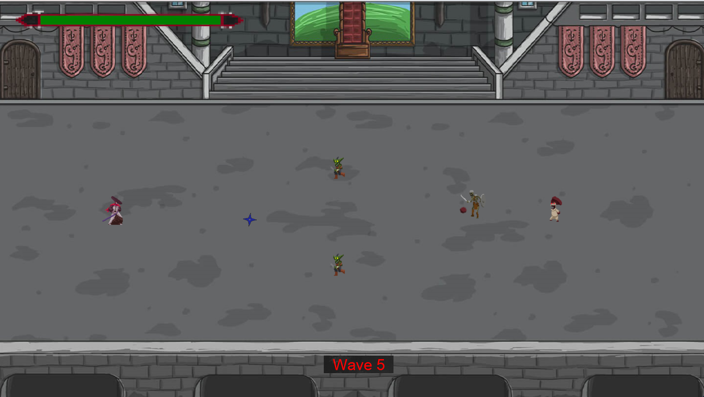

# Samurai-Legend
A detailed 2D game made entirely using Java/Javafx.

In this game, you have to clear 10 waves as a Samurai holding a katana.
Each wave consists of different enemies which have different attacks.
The final wave is a Dark Wizard boss who summons Skeletons that were previously slain.

You can also press Q to throw a shuriken which deals damage and teleports to the target that gets hit.

&nbsp;

